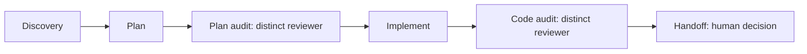

# AI Engineering Workflow

Use Codex or Claude Code on a real project without asking an AI to immediately change code and hoping
for the best.

Developed by [Grizzz AI](https://github.com/grizzz-ai).

## Why use this?

This repository gives your project a repeatable way to work with coding agents: understand the project,
propose a plan, have someone else review the plan, make the approved change, review the result, and leave
a clear handoff for the next human decision.

It is useful when you want AI help but still want to know what is changing and why. The workflow never
commits, pushes, opens a pull request, merges, deploys, or publishes on its own. You keep those decisions.

You can use Codex, Claude Code, or both. The workflow requires a reviewer who did not write the plan or
code. Using two runtimes can be a useful team practice, but it neither creates nor proves independent
review by itself: the reviewing actor must still be distinct.

## What the six skills do

| Step | Skill | What it does | Who checks it |
| --- | --- | --- | --- |
| 1 | `discovery` | Reads the repository and records the starting facts. | The next planner uses those facts. |
| 2 | `plan` | Proposes a small, testable change before files are edited. | A distinct reviewer checks the plan. |
| 3 | `plan-audit` | Challenges the plan, scope, risks, and checks. | An actor other than the planner. |
| 4 | `implement` | Makes only the change approved by the plan. | A distinct code reviewer checks the result. |
| 5 | `code-audit` | Compares the completed work with the plan and actual diff. | An actor other than the implementer. |
| 6 | `handoff` | Records evidence and names the next human decision. | You decide whether to commit, push, or merge. |



The six skills are installed inside the project you choose. They do not change your project code, Git
configuration, existing `AGENTS.md` or `CLAUDE.md`, or global agent settings.

## Start here

If you are new to VS Code, GitHub, or coding agents, read the
[first-time setup guide](docs/first-time-setup.md). It defines VS Code, a project repository, and the
integrated Terminal before asking you to type anything. It starts with a small local Git repository so
you can practise safely.

The first local experiment does **not** need a GitHub account. You need a GitHub connection later when
you want to use GitHub branches, pull requests, and review. SSH is recommended; HTTPS with `gh auth`
is another option.

## Quickstart

When you are ready, clone this workflow once outside the repositories where you write code. In VS Code,
open **Terminal > New Terminal**, then run these lines one at a time:

```sh
mkdir -p "$HOME/.local/share"
cd "$HOME/.local/share"
git clone https://github.com/grizzz-ai/ai-engineering-workflow.git
```

Open the Git repository where you want help with your code. This is your **project repository**. In that
repository's VS Code terminal, run:

```sh
"$HOME/.local/share/ai-engineering-workflow/install.sh"
```

The installer copies the six workflow skill files into your selected project and creates local Claude
Code links to the same files. It records where they came from and checks the result.

To confirm the installation later without changing anything, run this from your project repository:

```sh
"$HOME/.local/share/ai-engineering-workflow/install.sh" --check
```

Then open a Codex or Claude Code session in that project and begin with:

> Use the discovery skill to inspect this repository without changing files. Summarize its purpose,
> current Git status, and the next safest task.

For detailed installation layout, validation, update, and removal procedures, see
[Installation](docs/installation.md). For a complete example, see the
[Fail-Closed Configuration Example](examples/config-validation/README.md).

## What you need

- Git.
- A Git repository you own or are allowed to work in.
- Codex and/or Claude Code, installed and signed in through each product's supported flow.
- GitHub access only when cloning this repository while it remains private, or when you later use
  GitHub branches, pull requests, and review.

The compatibility checks used Codex `0.153.4` and Claude Code `2.1.2` on macOS. They are tested
configurations, not a claim that these are the only usable versions. Windows compatibility has not been
verified.

## Repository layout

```text
.agents/skills/     Canonical source for the six workflow skills
.ai-workflow/       Worked workflow evidence
.github/            Issue and pull-request intake templates
CONTRIBUTING.md     Contribution guidance
docs/               Beginner and technical installation guides
examples/           Synthetic worked example
install.sh          Repository-local installer
LICENSE             Apache License 2.0
NOTICE              Copyright notice
package.json        Configuration-example test script
README.md           This introduction
SECURITY.md         Private security-reporting instructions
SUPPORT.md          Bug, question, and feedback routes
tests/              Installer integration checks
```

## Limits

- The worked example demonstrates a narrow repository-local correction, not production readiness.
- Independent review depends on distinct people or actors; two AI clients alone do not supply it.
- Commit, push, pull-request creation, merge, deployment, and publication require separate decisions.

## Support

Use [GitHub Issues](https://github.com/grizzz-ai/ai-engineering-workflow/issues) for installation problems, documentation errors, and reproducible compatibility reports.

## License

Licensed under the Apache License, Version 2.0. See [LICENSE](LICENSE).
