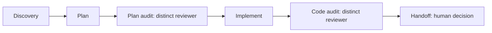

# Grizzz Ursa

Use two AI coding agents on a real project without asking one of them to immediately change code and
hoping for the best.

Developed by [Grizzz AI](https://github.com/grizzz-ai).

## Why we made this

You may know exactly what you want to build but not have time to learn every framework, library, or
unfamiliar part of a codebase before starting. Coding agents can do that research and implementation
work quickly. The problem is that one agent can also confidently follow the wrong path.

This is our practical answer: let one agent investigate and make a bounded change, then ask a second
agent from a different provider to challenge the plan and result. You get a second perspective before
you spend time reviewing a long diff yourself.

We recommend **Codex + Claude Code**. Start with either one if that is all you have, but the useful
setup is two separate agents: one does the work and the other reviews it. The reviewer must be a
different session or actor from the author; merely changing a model name does not make a review
independent.

The workflow keeps this collaboration short and visible: understand the project, agree on a plan,
make the change, check it, then leave the human with the decision. It never commits, pushes, opens a
pull request, merges, deploys, or publishes on its own. You keep those decisions.

## How it works

You do not need to memorise six commands or read six long documents. Start with the first request in the
guide. The agents use the remaining steps when the task needs them.

| Step | Skill | What it means for you |
| --- | --- | --- |
| 1 | `ursa-discover` | The agent learns what your project is and what is safe to do next. |
| 2 | `ursa-plan` | It proposes a small change in plain language before editing files. |
| 3 | `ursa-plan-audit` | The second agent looks for missing steps, risks, and bad assumptions. |
| 4 | `ursa-implement` | The first agent makes only the approved change. |
| 5 | `ursa-code-audit` | The second agent checks the actual diff against the plan. |
| 6 | `ursa-handoff` | You receive the evidence and decide whether anything is committed or merged. |



The six skills are short workflow instructions, not a second application you must learn. The installer
and its tests are real scripts in this repository; the skills tell the agents when to use them and when
to stop. Installation does not change your project code, Git configuration, existing `AGENTS.md` or
`CLAUDE.md`, or global agent settings.

## Start here

If you are new to VS Code, GitHub, or coding agents, read the
[first-time setup guide](docs/first-time-setup.md). It defines VS Code, a project repository, and the
Extensions panel before asking you to type anything. Use your own GitHub project, or a small private
practice repository, so you can try the workflow safely.

The workflow needs a GitHub repository and the GitHub CLI (`gh`) signed in with `gh auth login`.
SSH or HTTPS connects Git to your code; `gh` lets the agents read issues and pull requests too.
Signing in to Codex or Claude Code is a separate step. The guide walks through all three connections.

## Quickstart

When you are ready, clone this workflow once outside the repositories where you write code. In VS Code,
open **Terminal > New Terminal**, then run these lines one at a time:

```sh
mkdir -p "$HOME/.local/share"
cd "$HOME/.local/share"
git clone https://github.com/grizzz-ai/ursa.git
```

Open the Git repository where you want help with your code. This is your **project repository**. In that
repository's VS Code terminal, run:

```sh
"$HOME/.local/share/ursa/install.sh"
```

The installer copies the six workflow skill files into your selected project and creates local Claude
Code links to the same files. It records where they came from and checks the result.

To confirm the installation later without changing anything, run this from your project repository:

```sh
"$HOME/.local/share/ursa/install.sh" --check
```

If VS Code was open during installation, quit and reopen it with your project folder. Then open a new
agent chat in that project and send just the skill command:

- **Claude Code:** `/ursa-discover`
- **Codex:** `$ursa-discover`, or select the skill from `/skills`.

No task description is needed yet. You get a project overview, current GitHub work, and two or three
possible next steps. Choose one in ordinary language; the agents manage the technical records.
Discovery does not change project code. When allowed, it saves its record under `.ai-workflow/`;
if you or the repository forbid writes, it gives an unsaved overview instead.
Codex may ask for network access to GitHub. Allow that scoped read so the agent can inspect issues
and pull requests; a network restriction does not mean your GitHub login is broken.

For installation details, validation, updates, and removal, see
[Installation](docs/installation.md).

## What you need

- Git.
- A Git repository you own or are allowed to work in.
- Codex and/or Claude Code, installed and signed in through each product's supported flow.
- A GitHub remote for your project, GitHub CLI installed, and `gh auth login` completed.
- Permission for the agent to read GitHub over the network.

The compatibility checks used Codex `0.153.4` and Claude Code `2.1.2` on macOS. They are tested
configurations, not a claim that these are the only usable versions. Windows compatibility has not been
verified.

## Repository layout

```text
.agents/skills/     Canonical source for the six workflow skills
.github/            Issue and pull-request intake templates
CONTRIBUTING.md     Contribution guidance
docs/               Beginner and technical installation guides
install.sh          Repository-local installer
LICENSE             MIT License
README.md           This introduction
SECURITY.md         Private security-reporting instructions
SUPPORT.md          Bug, question, and feedback routes
tests/              Installer integration checks
```

## Limits

- Independent review depends on distinct people or actors; two AI clients alone do not supply it.
- Commit, push, pull-request creation, merge, deployment, and publication require separate decisions.

## Support

Use [GitHub Issues](https://github.com/grizzz-ai/ursa/issues) for installation problems, documentation errors, and reproducible compatibility reports.

## License

Licensed under the MIT License. See [LICENSE](LICENSE).
